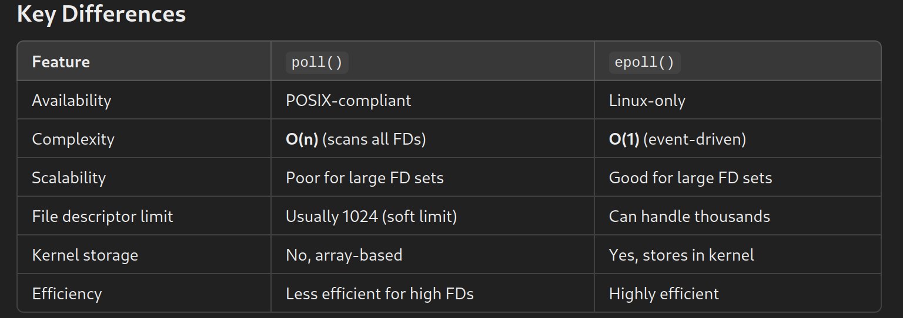

My Makefile creates a folder nammed tmp that will contain all .o and .d files
It also contains the rule pedantic which forces u to add a new line at the end of each file!

Allowed functions:
	- Everything in C++ 98.
	- socket
	- close
	- setsockopt
	- getsockname
	- getprotobyname
	- gethostbyname
	- getaddrinfo
	- freeaddrinfo
	- bind
	- connect
	- listen
	- accept
	- htons
	- htonl
	- ntohs
	- ntohl
	- inet_addr
	- inet_ntoa
	- send
	- recv
	- signal
	- sigaction
	- lseek
	- fstat
	- fcntl
	- poll // better use epoll() !!!!!!!!!!!!!
	- (or equivalent)

Even if poll() is mentionned in the subject and the evaluation scale,
you can use any equivalent such as select(), kqueue(), or epoll().

Forking is not allowed. All I/O operations must be non-blocking.
	Only 1 poll() (or equivalent) can be used for handling all these operations
	(read,write, but also listen, and so forth).

Because you have to use non-blocking file descriptors, it is possible to use
read/recv or write/send functions with no poll() (or equivalent), and
your server wouldn’t be blocking. But it would consume more system resources.
Thus, if you try to read/recv or write/send in any file descriptor without using
poll() (or equivalent), your grade will be 0.!!!!!!!!!!!!!

Implement the following features:
◦ You must be able to authenticate, set a nickname, a username, join a channel,
	send and receive private messages using your reference client.

◦ All the messages sent from one client to a channel have to be forwarded to
	every other client that joined the channel.

◦ You must have operators and regular users.

◦ Then, you have to implement the commands that are specific to channel operators:
	∗ KICK - Eject a client from the channel
	∗ INVITE - Invite a client to a channel
	∗ TOPIC - Change or view the channel topic
	∗ MODE - Change the channel’s mode:
	· i: Set/remove Invite-only channel
	· t: Set/remove the restrictions of the TOPIC command to channel operators
	· k: Set/remove the channel key (password)
	· o: Give/take channel operator privilege
	· l: Set/remove the user limit to channel

Need to investigate: 
/r/n LRCF --> endline for internet request. (for all we receive and send) AND THIS IS A MUST!!! listen, split, send.

https://modern.ircdocs.horse/

https://medium.com/@afatir.ahmedfatir/small-irc-server-ft-irc-42-network-7cee848de6f9

https://reactive.so/post/42-a-comprehensive-guide-to-ft_irc/

https://www.man7.org/linux/man-pages/man2/socket.2.html

https://www.man7.org/linux/man-pages/man7/socket.7.html